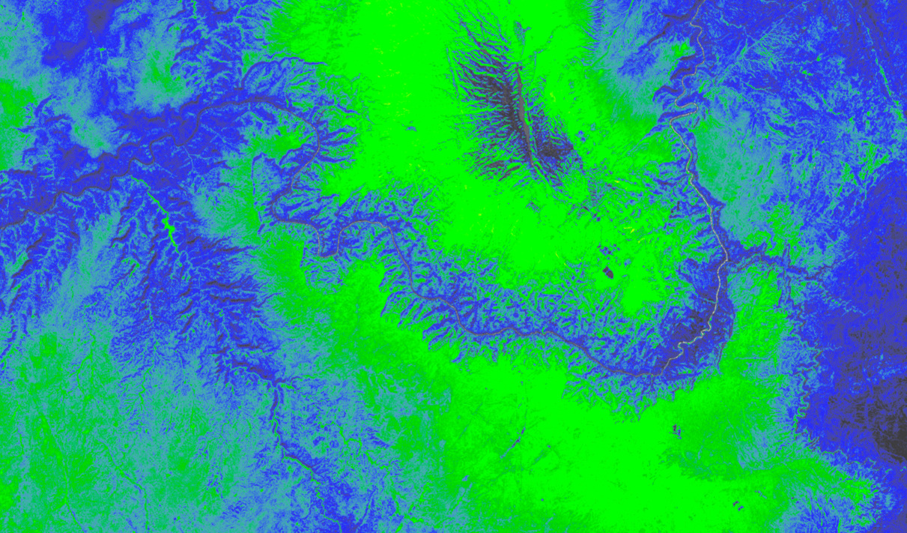

# deck.gl-raster

deck.gl layers and WebGL modules for client-side satellite imagery processing on the GPU.

[][docs_website]

Landsat [Modified Soil Adjusted Vegetation Index][msavi] over the Grand Canyon and Kaibab Plateau, with the [`cfastie` colormap][cfastie].

[msavi]: https://www.usgs.gov/land-resources/nli/landsat/landsat-modified-soil-adjusted-vegetation-index
[cfastie]: assets/colormaps/cfastie.png

## Overview

[deck.gl](https://deck.gl) is a great geospatial rendering engine for the
browser. deck.gl layers are designed to be composable and easy to extend. As
such, small variations of the pre-built layers can do amazing new things, while
not being fit for inclusion in the standard layer library.

This repository contains deck.gl layers and reusable WebGL modules for rendering
and computation on rasters, especially satellite imagery.

[Documentation Website][docs_website]

[docs_website]: https://kylebarron.dev/deck.gl-raster
